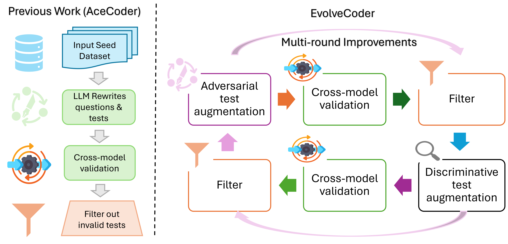

# EvolveCoder: Evolving Test Cases via Adversarial Verification for Code Reinforcement Learning

[](https://arxiv.org/abs/2603.12698)
[](https://huggingface.co/datasets/TIGER-Lab/EvolveCoder-22K)
[](LICENSE)

## Overview

**EvolveCoder** is a framework that iteratively evolves test cases through adversarial verification to strengthen verification signals for code reinforcement learning. By running multiple rounds of test case evolution, it produces harder, more discriminative test cases that expose weaknesses in candidate solutions.

We release **EvolveCoder-22K**, a large-scale coding RL dataset built with this pipeline.

<p align="center">
  
</p>

## Dataset

The EvolveCoder-22K dataset is available on HuggingFace:

```python
from datasets import load_dataset
dataset = load_dataset("TIGER-Lab/EvolveCoder-22K")
```

## Installation

```bash
# Option 1: uv
uv sync
uv pip install -e .

# Option 2: conda
conda create -n evolvecoder python=3.10
conda activate evolvecoder
pip install -e .
```

Set your API key:

```bash
export OPENAI_API_KEY="your_openai_api_key"
```

## Data Generation Pipeline

The pipeline consists of three phases: **Initial Generation**, **Solution Generation**, and **Iterative Test Evolution**.

### Phase 1: Initial Generation

#### Step 1: Problem Prompting
Generate initial solution attempts for each coding problem using an API model.

- **Input:** Raw dataset (e.g., TACO)
- **Output:** `outputs/{dataset}/{model}/step1_prompting_results.jsonl`

```bash
python evolvecoder/step1_prompting.py \
    --sub_dataset_name all \
    --model_name gpt-4.1-mini \
    --max_concurrent 16 \
    --save_batch_size 8
```

#### Step 1.1: Parsing
Parse and clean the generated solutions.

- **Input:** `step1_prompting_results.jsonl`
- **Output:** `step1.1_parsing.jsonl`

```bash
python evolvecoder/step1.1_parsing.py \
    evolvecoder/outputs/all/gpt_4.1_mini/step1_prompting_results.jsonl \
    --num_proc 16
```

Or run both steps at once:

```bash
bash evolvecoder/step1.sh
```

---

### Phase 2: Solution Generation

#### Step 2.1: Solution Generation (vLLM)
Generate multiple candidate solutions per problem using a local model via vLLM.

- **Input:** `step1.1_parsing.jsonl`
- **Output:** `step2.1_vllm_gen.jsonl`

```bash
bash evolvecoder/step2.1_gen.sh
```

> Supports multi-GPU parallel generation. Set `CUDA_VISIBLE_DEVICES` to control GPU usage.

#### Step 2.2: Evaluation
Evaluate generated solutions against initial test cases to produce an evaluation matrix.

- **Input:** `step2.1_vllm_gen.jsonl`
- **Output:** `step2.2_eval.jsonl`

```bash
python evolvecoder/step2.2_eval.py <input_file> --num_proc 64
```

---

### Phase 3: Iterative Test Evolution

Run multiple rounds of adversarial test case evolution. Each round refines and hardens the test cases based on the behavior of candidate solutions.

```bash
bash evolvecoder/step3.sh [NUM_ROUNDS]  # default: 4 rounds
```

The following steps run automatically per round:

#### Step 3.1: Filter Tests (First Pass)
Filter existing tests based on solution evaluation results to identify weak/easy tests.

- **Input:** `step2.2_eval.jsonl` (round 1) or previous round's `step3.7` output
- **Output:** `round_{N}/step3.1_filter_tests_round_{N}.jsonl`

#### Step 3.2: Generate New Tests
Use an API model to generate adversarial test cases targeting identified weaknesses.

- **Input:** `step3.1_filter_tests_round_{N}.jsonl`
- **Output:** `round_{N}/step3.2_gen_tests_results_round_{N}.jsonl`

#### Step 3.3: Parse Generated Tests
Parse and validate the newly generated test cases.

- **Input:** `step3.2_gen_tests_results_round_{N}.jsonl`
- **Output:** `round_{N}/step3.3_parsing_tests_round_{N}.jsonl`

#### Step 3.4: Filter Tests (Second Pass)
Further filter tests to keep the most discriminative ones.

- **Input:** `step3.3_parsing_tests_round_{N}.jsonl`
- **Output:** `round_{N}/step3.4_filter_tests_round_{N}.jsonl`

#### Step 3.5: Generate Refined Tests
Generate a second set of refined tests conditioned on the filtered test cases.

- **Input:** `step3.4_filter_tests_round_{N}.jsonl`
- **Output:** `round_{N}/step3.5_gen_tests_results_round_{N}.jsonl`

#### Step 3.6: Parse Refined Tests
Parse and validate the refined test cases.

- **Input:** `step3.5_gen_tests_results_round_{N}.jsonl`
- **Output:** `round_{N}/step3.6_parsing_tests_round_{N}.jsonl`

#### Step 3.7: Evaluate Evolved Tests
Execute all candidate solutions against the evolved test suite to produce final evaluation results.

- **Input:** `step3.6_parsing_tests_round_{N}.jsonl`
- **Output:** `round_{N}/step3.7_eval_round_{N}.jsonl`

> This output becomes the input for the next round's Step 3.1.

---

### Phase 4: Final Processing

#### Step 4.1: Final Filter
Apply final filtering criteria to select high-quality (problem, test) pairs.

- **Input:** Last round's `step3.7_eval_round_{N}.jsonl`
- **Output:** `step4.1_filter_round_{N}.jsonl`

```bash
python evolvecoder/step4.1_filter.py <input_file> --num_proc 64
```

#### Step 4.2: Final Evaluation
Run final evaluation to compute metrics across the filtered dataset.

- **Input:** `step4.1_filter_round_{N}.jsonl`
- **Output:** `step4.2_eval_round_{N}.jsonl`

```bash
python evolvecoder/step4.2_eval.py <input_file> --num_proc 64
```

---

## Citation

```bibtex
@article{ruan2026evolvecoder,
  title={EvolveCoder: Evolving Test Cases via Adversarial Verification for Code Reinforcement Learning},
  author={Ruan, Chi and Jiang, Dongfu and Zeng, Huaye and Nie, Ping and Chen, Wenhu},
  journal={arXiv preprint arXiv:2603.12698},
  year={2026}
}
```
